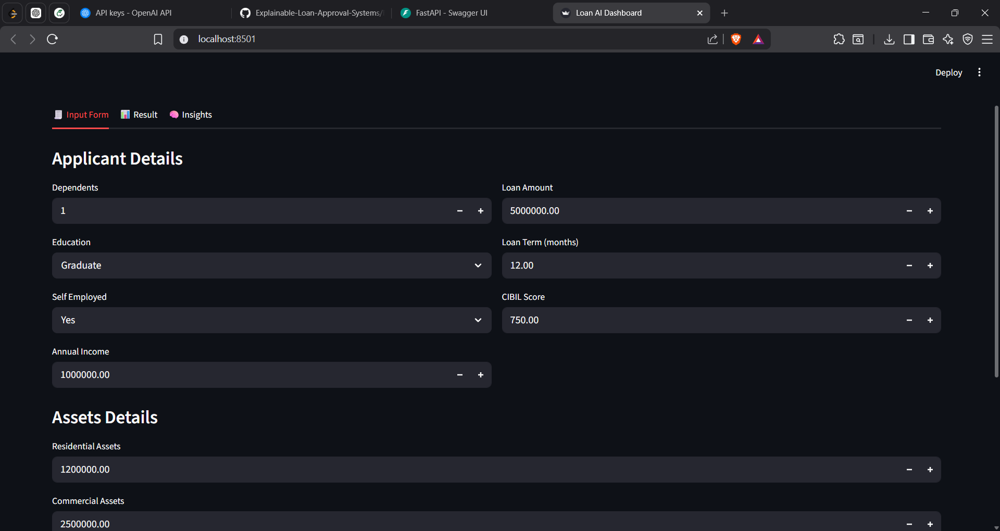
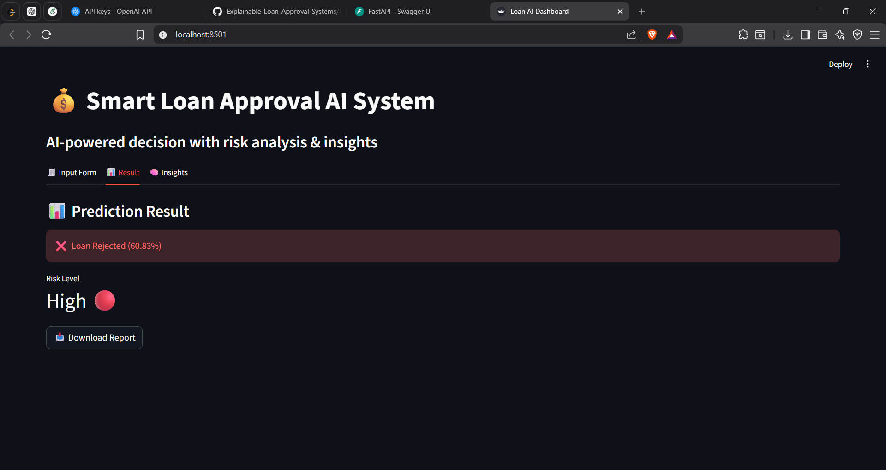
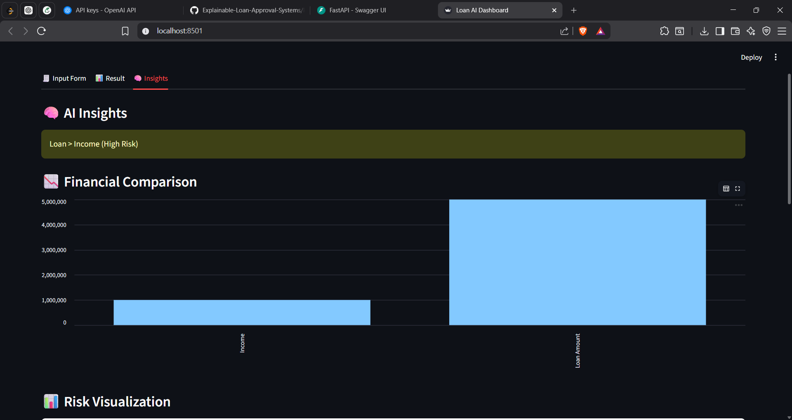

# 💼 Explainable Loan Approval System

## 📌 About the Project

This project is a machine learning-based application that predicts whether a loan should be approved or rejected.
I built this system with a focus on **explainability**, so that users can also understand the reason behind each prediction instead of just seeing the result.

---

## 🚀 What it does

* Predicts loan approval using trained ML models
* Shows prediction result with approval/rejection probability
* Performs basic risk analysis (Low / Medium / High)
* Provides insights to understand key factors affecting the decision
* Interactive dashboard built using Streamlit

---

## 🛠️ Tech Used

* Python
* Pandas & NumPy
* Scikit-learn
* Streamlit

---

## 📂 Project Structure

```
Explainable-Loan-Approval-System/
│── data/        # dataset files  
│── model/       # trained model  
│── app.py       # main app file  
│── train.py     # model training  
│── README.md  
```

---

## ⚙️ How to Run the Project

1. Clone the repository:

```
git clone https://github.com/komaljangid17/Explainable-Loan-Approval-Systems.git
```

2. Go into the project folder:

```
cd Explainable-Loan-Approval-Systems
```

3. Install required libraries:

```
pip install -r requirements.txt
```

4. Run the app:

```
streamlit run app.py
```

---

## 📸 Screenshots

### 📝 Input Form



### 📊 Prediction Result



### 📈 Insights




---

## 🎯 Future Improvements

* Improve UI design
* Add more detailed explainability (like SHAP/LIME)
* Deploy the project online

---

## 🙌 Note

This project was created as part of my learning in machine learning and solving real-world financial problems.
